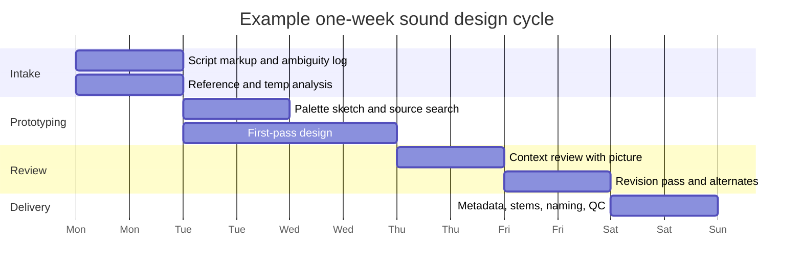

# Translating Text Into Executable Sound Design Briefs

## Executive Summary

A professional sound-design brief should not stop at adjectives like “dark,” “organic,” or “epic.” The most useful briefs combine narrative meaning, source/event description, measurable acoustic targets, psychoacoustic role in the mix, production strategy, and a delivery contract. Research on environmental-sound retrieval and ecological acoustics shows that descriptions become far more usable when semantic labels are tied to acoustic content and source/event relations, while audio-captioning benchmarks show that strong descriptions typically include object, action, environment, physical properties, and higher-level meaning. citeturn23view0turn24view0turn29search1turn29search6

For human listeners, the important design question is not only “what is the sound?” but also “what should the audience notice, feel, and understand first?” Work on entity["academic_field","Psychoacoustics","study of human sound perception"] shows that semantic context, long-range scene context, timbral deviation, spatial separation, and first-arrival cues all shape attention. In practice, that means a brief must specify not just a target sound, but its priority, masking risk, spatial role, and acceptable stylization. citeturn25view2turn25view3turn24view9turn24view10turn26search6turn7search10

On delivery, a brief becomes professional when it is legible to editors, mixers, librarians, and downstream tools. Current primary standards and de facto conventions point to structured naming and metadata via the Universal Category System, Broadcast Wave/iXML, and ADM/BW64 when object-based or immersive delivery is required, plus loudness conformance against BS.1770-derived workflows such as EBU R 128 and ATSC A/85. Evaluation should include both context listening and formalized A/B or MUSHRA-like tests rather than isolated “does this sound cool?” judgments. citeturn4search0turn3search0turn3search1turn5search8turn1search11turn6search2turn0search0turn2search0turn28search0turn28search1

## Scope, Assumptions, and Research Basis

I began with the enabled internal connectors the user requested. The Google Calendar search returned no relevant events, the Linear search returned no relevant issues, and the Gmail connector required interactive authorization in this execution mode, so the substantive findings below rely on external primary sources, open academic papers, and official technical documentation rather than internal company material.

Because no genre, platform, or budget was specified, this report assumes a human sound designer is creating reusable assets for linear or interactive post, with a stereo-first review path that can scale to surround or object-based delivery later. The report also assumes there is no mandatory house style, no locked loudness target beyond destination standards, and no prohibition on combining recording, Foley, synthesis, and heavy post-processing.

The most consequential unspecified details are these:

| Unspecified detail | Why it matters | Safe default used here |
|---|---|---|
| Medium | Film, episodic, game, trailer, podcast, and branded content want different density and dynamic behavior | Write briefs that survive both linear and interactive contexts |
| Playback endpoint | Phone, TV, headphones, cinema, gallery, and game console radically change bass, width, and masking tolerance | Judge on nearfields + headphones; avoid endpoint-specific hype unless requested |
| Sync precision | UI, gameplay, footsteps, idents, and transitions have very different frame sensitivity | Assume frame-accurate sync is required for transient events |
| Perspective | POV, exterior, interior, memory, dream, and editorialized montage all imply different filtering and spatialization | Explicitly state listening perspective in the brief |
| Delivery format | Mono sync, stereo design, 5.1, ambisonics, object-based, looped ambience, and stems all change design choices | Request a delivery contract inside the brief itself |
| Rights and provenance | Library, custom recording, AI-assisted processes, and vendor assets have different reuse restrictions | Track provenance and version history from day one |

Where the destination is broadcast or regulated distribution, loudness and interchange should follow the destination spec, not habit. EBU R 128 centers programme loudness normalization around -23 LUFS and paired descriptors such as Loudness Range and Maximum True Peak, while ATSC A/85 builds U.S. television practice around BS.1770 measurement and loudness management. EBU also notes that streaming services frequently use target loudness values higher than broadcast, which is why “normalize to one house target for everything” is the wrong default when platform is unspecified. citeturn0search0turn0search1turn0search5turn2search0turn2search23turn1search3

## A Layered Framework for Translating Situation Into Sound

The most robust way to turn text into an executable brief is to treat it as a layered translation problem. Environmental-sound research consistently separates source meaning, perceptual categories, and acoustic detail rather than collapsing them into one sentence. A brief works when it can be read by three people at once: the director or writer looking for story fit, the designer choosing methods, and the mixer managing context and intelligibility. citeturn24view0turn24view4turn23view0turn25view3

### The six-layer brief

| Layer | Key question | Required output in the brief |
|---|---|---|
| Narrative function | Why is the sound here? | Emotion, story role, attention priority, transition function, whether it should clarify or destabilize the scene |
| World placement | Where does it live relative to the story world? | Diegetic, non-diegetic, hybrid/editorialized, listener perspective, POV or omniscient framing |
| Source ontology | What produces it? | Source, material, action, mechanism, environment, scale, period, realism level |
| Acoustic signature | What should it sound like in measurable terms? | Timbre, pitch tendency, spectral centroid/brightness, roughness, dynamics, transient profile, density, texture, reverb, width, motion |
| Perceptual role | How must it behave against competing sounds? | Priority over dialogue/music/other FX, masking tolerance, localization target, desired salience, fatigue risk |
| Production and delivery | How will it be built and handed off? | Recording/Foley/synthesis/layering plan, processing notes, stems, naming, metadata, alternates, versioning, QC criteria |

A useful practical rule is to write each brief twice:

- **Story sentence:** what the audience should feel or infer.
- **Engineering sentence:** what the designer can build and the mixer can place.

Example:

- **Story sentence:** “A diegetic metal gate should feel like the scene’s point of no return.”
- **Engineering sentence:** “Single close transient with dark steel body, 120–250 Hz impact weight, 2–5 kHz scrape edge, narrow pre-rattle, tiled-tunnel tail around 1.5–2.0 s, mid-close perspective, designed to clear dialogue.”

Scholars of film music and sound have long noted that the diegetic/non-diegetic boundary is often porous rather than binary, so treating “world placement” as an axis is usually better than forcing a false yes/no classification. Temp material should therefore identify the intended relationship to the story world, not just a vibe reference. citeturn20search4turn22search2


### A simple translation grammar

When the source text is short, expand it in this order:

**Source** → **Action** → **Material** → **Environment** → **Perspective** → **Narrative function** → **Acoustic targets** → **Production method** → **Delivery**

For example, “door opens underwater” becomes:

- **Source:** pressure door
- **Action:** unlocking, seal release, heavy swing
- **Material:** steel, gasket, trapped water, bubbles
- **Environment:** submerged chamber, dense low-pass medium
- **Perspective:** listener inside helmet, near-mid distance
- **Narrative function:** suspense and scale
- **Acoustic targets:** softened transient, low groan, filtered highs, diffuse bubbles, slow decay
- **Production method:** metal stress recordings + hydrophone water + slowed valve releases + underwater filtering
- **Delivery:** sync mono, stereo exterior bloom, alt short version

## Descriptor System and Production Methods

No one vocabulary is sufficient for professional briefs. A good brief deliberately combines a cinematic vocabulary, a source-event vocabulary, an acoustic/timbral vocabulary, and a metadata vocabulary. Social-tag and timbre studies show that public-facing descriptors often cluster differently from acoustic descriptions, which is exactly why vague briefs fail in production: the writer and the designer may both say “warm” or “tense” but mean different things unless the brief also operationalizes the term. citeturn24view6turn30search0turn4search0turn29search6

### Descriptor vocabularies compared

| Vocabulary family | What it answers | Typical descriptors | Best use | Common failure mode |
|---|---|---|---|---|
| Narrative / cinematic | What does this do in the scene? | foreboding, reveal, punctuation, memory, relief, escalation | Director alignment, spotting, determining whether the sound should lead or support | Stops at emotion words and omits acoustics |
| Source-event / ecological | What physically produces it? | source, material, mechanism, impact, scrape, air, liquid, resonance | Search terms, recording plans, realism, foley cueing | Too literal for stylized or magical sounds |
| Acoustic / timbral | What will it sound like? | bright/dark, rough/smooth, tonal/noisy, dense/sparse, sharp/soft attack, narrow/wide | Design execution, mix planning, processing choices | Metaphors remain subjective if not mapped to measurable traits |
| Perceptual / mix | What must the listener notice first? | foreground, masked, off-screen, localizable, diffuse, fatiguing, sticky, subtle | Dialogue protection, salience control, playback translation | Ignored until the mix stage |
| Library / metadata | How will others find and reuse it? | category, subcategory, perspective, variation, creator, version, source ID | Hand-off, searchability, editor speed, archive hygiene | Naming is inconsistent or private to one designer |
| Caption / prompt | What does a general-language description need? | object + action + environment + property + high-level meaning | Intake from scripts, AI assist tools, producer communication | Too prose-heavy; omits duration, perspective, or constraint |

### Turning semantic descriptors into acoustic targets

Several reliable mappings are strongly supported by timbre and salience research:

- **Brightness** usually implies more high-frequency emphasis and often tracks spectral centroid.
- **Roughness** is associated with faster amplitude fluctuations or harsh micro-variation.
- **Salience** is often driven less by absolute “more bright” or “more rough” and more by deviation from the surrounding context.
- **Meaningful events** are not only acoustically salient; semantics and longer scene context can also make them perceptually salient. citeturn24view9turn24view10turn25view1turn25view3

That produces an actionable rule:

> **Do not ask the designer for “a more noticeable sound.” Ask for a sound that is more deviant in the dimensions that matter in context: brightness, roughness, transient sharpness, spectral vacancy, or spatial contrast.**

### A quick operational lexicon

| If the text says… | Translate it acoustically as… |
|---|---|
| warm | less 3–8 kHz aggression, fuller low-mid body, softer transient edge |
| cold | less low-mid warmth, more high-mid focus, harder transient boundary |
| ancient | slower rise, uneven pitch stability, friction/noise, longer structural resonance |
| sleek | lower noise floor, cleaner envelope, fewer rattles, tighter bandwidth |
| anxious | unstable modulation, unresolved pitch, restrained low end, repeated micro-motifs |
| powerful | strong low-frequency support, controlled dynamic rise, broad resonance, slower decay if scale matters |
| intimate | reduced reverb tail, close-mic detail, lower width, audibly tactile micro-texture |
| distant | softened transient, reduced high end, more diffuse early reflections, weaker direct signal |
| magical | inharmonic or harmonic bloom beyond realistic source behavior, filtered reverses, widening tails |
| realistic | coherent source cues, plausible perspective, material-specific transients, limited editorial sweetening |

### Synthesis, recording, and hybrid tradeoffs

The choice between synthesis and recording is not aesthetic only; it is about controllability, synchrony, uniqueness, and reuse. Ecological acoustics favors source-recognition cues, Foley is especially strong for synchronized gesture and character detail, convolution excels when realistic spaces matter, while granular/morphing/resynthesis methods are strongest when the brief calls for impossible, transitional, or hybrid sounds. Official product documentation for convolution, morphing, granular processing, unmixing, and procedural layering all point in the same direction: the most flexible professional approach is hybrid. citeturn24view0turn13search0turn15search6turn16search0turn18search0turn17search6turn32search3

| Method | Strengths | Weaknesses | Best use | Avoid when |
|---|---|---|---|---|
| Field recording | High realism, rich uncontrolled detail, believable perspective | Time, logistics, cleanup, weaker recallability | Vehicles, ambiences, mechanicals, location truth | You need frame-perfect gesture or impossible behavior |
| Foley | Perfect sync, character nuance, repeatable performance, tactile detail | Can sound stagey if overused, requires skilled performance | Footsteps, cloth, props, body movement, hand interactions | Large-scale ambience or high-speed source complexity |
| Subtractive / FM / physical modeling synthesis | Precise control, easy variation, clean stems, repeatability | Can lack physical richness if naked | UI, drones, servos, sci-fi, tonal warnings, engine layers | Organic detail is the core appeal |
| Granular processing | Excellent for time-stretched texture, memory states, magical transitions | Easy to become generic “granular haze” | Transformations, dream states, spectral blooms, creature beds | Clean realism or intelligibility is required |
| Resynthesis / morphing | Hybrid timbres, impossible source fusion, signature sounds | Harder to keep semantically legible | Creatures, monoliths, stylized weapons, logo tails, surreal transitions | The audience must instantly identify a mundane source |
| Convolution | Real-space credibility, consistent tails, environmental matching | Weak if direct sound is poor, can over-literalize | Match location acoustics, integrate ADR/Foley with world, immersive tails | The design needs abstract or hyperreal space |
| Spectral repair / unmix | Salvage, isolate, rebalance, derive layers from messy material | Can introduce artifacts, not a substitute for design intent | Restoration, deconstruction, deriving tonal/noise/transient layers | You need clean source from scratch faster than editing allows |

### Recommended tools and plugins

The categories below are representative rather than exhaustive. The goal is a tool stack that covers editing, search/metadata, restoration, spatial realism, procedural variation, and stylized transformation. Capability summaries below are grounded in official documentation. citeturn12search0turn12search1turn11search0turn11search6turn13search0turn15search6turn15search0turn15search3turn16search0turn18search2turn17search6turn33search4

| Role | Representative tools | Why they are strong | Watch-outs |
|---|---|---|---|
| Full DAW / editorial hub | REAPER, Nuendo-class post DAWs | Fast editing, routing, scripting, multiformat export, post-friendly session architecture | Facility compatibility and team familiarity may matter more than raw feature count |
| Restoration / spectral surgery | RX, SpectraLayers | Noise control, spectral editing, repair, de-reverb, unmixing, component separation | Easy to over-clean and remove life or perspective |
| Asset search / metadata | Soundminer | Embedded metadata, transfer workflows, thesaurus/search, spotting organization | Garbage metadata still yields garbage search |
| Convolution reverb / space matching | Altiverb | Real spaces, impulse response management, useful when realism and location-matching matter | Literal spaces can reduce stylization and cut-through |
| Procedural layered design | Weaponiser | Rapid multi-layer triggering, variation, one-plugin performance design | Can encourage samey “trailerized” habits if presets dominate |
| Granular / transformational FX | Portal | Fast textural mutation and playable granular edits | Great for transition design, but easy to overuse |
| Morphing / hybrid timbre design | MORPH 3 | Cross-synthesis, style transfer, transitional and hybrid signatures | Semantic legibility can collapse if both sources are too abstract |
| Interactive audio / spatial logic | Wwise | Authoring, propagation, SoundBanks, spatial audio, object-aware workflows | Overhead is unjustified for purely linear work |

Official product pages: urlREAPERturn12search1, urlRX 12turn12search0, urlSoundminerhttps://www.soundminer.com, urlAltiverbturn13search0, urlWeaponiserturn15search6, urlPortalturn16search0, urlMORPH 3turn18search2, urlWwisehttps://www.audiokinetic.com/en/wwise/, urlSpectraLayershttps://www.steinberg.net/spectralayers/.

## Workflow, Deliverables, and Evaluation

Professional briefs improve fastest when they are reviewed in context, against explicit references, and through structured versioning. Temp tracks remain useful as blueprints, but only if the brief says *what the temp is proving*: timing, narrative function, apparent size, width, decay, or iconography. “Make it like the temp” is poor direction; “match the temp’s narrow transient and delayed bloom, but not its tonal center or scale implication” is good direction. citeturn22search2



### Metadata and deliverables that scale

A professional hand-off should assume the sound will be searched, revised, re-cut, conformed, and possibly repurposed later. Official metadata standards support that expectation. BWF provides a standard audio container with metadata support; iXML extends production metadata exchange; UCS provides a common naming/category framework for SFX libraries; ADM and BW64 matter when object-based or large immersive deliverables are in scope. citeturn3search0turn3search1turn5search8turn4search0turn4search11turn1search11turn6search2turn15search3

| Deliverable | Minimum expectation | Notes |
|---|---|---|
| Source asset | WAV/BWF with creator, source ID, description, take or variation, version, channel config | Keep pre-render sources if major redesign is likely |
| Editorial sync print | Clean single file aligned to picture or event trigger | For frame-critical events, include head/tail handles |
| Tail or bloom stem | Separate reverb/space/halo layer | Lets mixers rebalance space independently of impact |
| Design premix | Consolidated stereo or multichannel design stem | Useful when the asset is too layer-heavy for editorial |
| Alternates | Intensity tiers and perspective variants | Minimum set: subtle, main, aggressive; close and medium if perspective matters |
| Library-ready package | UCS-style naming plus searchable descriptive metadata | Include source provenance and prohibited uses if any |
| Immersive or object-based master | ADM/BW64 when required | Only generate if downstream truly supports it |

A sound brief should also require a **versioning scheme**. A simple format is enough:

- `scene_cue_asset_intent_v001`
- `scene_cue_asset_intent_v002_subtle`
- `scene_cue_asset_intent_v003_close`
- `scene_cue_asset_intent_v003_tailonly`

### Loudness and QC

Loudness is not purely a mastering issue; it changes how the brief should be interpreted. If the sound must survive broadcast, EBU R 128 and ATSC A/85 remain the important anchors. BS.1770 defines the programme loudness and true-peak measurement base used by these workflows. If the destination is streaming, EBU explicitly notes that targets are typically higher than classic broadcast, so the brief should say **which destination governs** instead of assuming a single loudness target for all outputs. citeturn0search0turn0search5turn1search3turn2search0turn2search23

### Evaluation checklist and listening tests

Use a checklist that combines creative fit and perceptual performance. ITU-R BS.1116 is a good model when you need to detect small impairments; BS.1534 MUSHRA is a practical model when comparing intermediate-quality or stylistic alternatives. Even when you run an informal internal test, borrowing those disciplines improves decisions: trained listeners, level matching, anchor conditions, blind comparison, and written criteria. citeturn28search1turn28search9turn28search0

| Dimension | Review question | Pass condition | Test method |
|---|---|---|---|
| Narrative fit | Does it communicate the intended story role? | Listener infers the intended function without explanation | Blind scene playback with written responses |
| Semantic clarity | Is the source/action legible at the intended realism level? | Correct identification when realism is required, or intended ambiguity when not | A/B in-context plus isolated spot-check |
| entity["scientific_concept","Auditory masking","psychoacoustic interaction between sounds"] control | Does it disappear under dialogue or music when it should not? | Priority elements remain intelligible without excessive level inflation | In-context stem playback, duck/no-duck comparison |
| entity["scientific_concept","Auditory salience","attention-capturing property of sound"] | Does it draw attention at the right moment and not elsewhere? | Attention peaks where intended, with no distracting false peaks | Blind timeline marking from reviewers |
| Space and localization | Does the image position and depth feel right? | Stable localization and believable depth on speakers and headphones | Speaker + headphone pass |
| Material credibility | Does it feel like the stated source/material? | No obvious mismatch between sound and implied material | Source-recognition review |
| Playback translation | Does it survive small speakers, TV, and headphones? | Core identity survives on all target endpoints | Multidevice check |
| Metadata / reuse | Can another editor find and identify it instantly? | Searchable, versioned, legible, provenance included | Librarian/editor review |
| Loudness compliance | Does it meet destination constraints? | Measured pass against destination standard | Meter + QC log |
| Alternate usefulness | Do the provided alts actually solve editorial/mix problems? | Alts differ meaningfully in density, size, or priority | Editorial use-case test |

A very practical internal test matrix is:

1. **Scene test** — full mix context, normal playback level.
2. **Dialogue stress test** — push dialogue up slightly and check whether the intended FX still reads.
3. **Translation test** — headphones, TV speakers, laptop/phone.
4. **Blind alternate test** — compare vA/vB without labels.
5. **Fatigue test** — loop repeatedly; reject sounds that become brittle, funny, or annoying faster than intended.

## Templates and Prompt Scaffolds

Audio-captioning work is useful here because it clarifies what a short text prompt usually omits: physical properties, environment, and high-level meaning. Stronger prompts describe *what is happening*, *what it sounds like*, and *why it matters*. citeturn29search1turn29search6

### Short prompt template

Use this when speed matters and the designer already knows the project language.

```text
[Source/action] in/through [environment], heard from [perspective].
Function: [story role / emotion / priority].
Sound like: [3–5 acoustic targets].
Avoid: [1–3 exclusions].
```

**Example**

```text
Heavy steel gate slams in an abandoned subway tunnel, heard from mid-close distance.
Function: end-of-chase punctuation and threat.
Sound like: dark metal body, short pre-rattle, sharp scrape edge, long tiled-tunnel tail.
Avoid: cartoon clang, exaggerated trailer boom, bright glassy highs.
```

### Detailed brief template

Use this for custom design, outsourcing, or high-ambiguity cues.

```text
Cue name:
Scene / trigger:
Duration / sync requirement:
Narrative function:
World placement:
Listener perspective:
Source ontology:
- source:
- material:
- action/mechanism:
- scale:
- realism level:

Acoustic targets:
- timbre:
- pitch tendency:
- spectral emphasis:
- transient shape:
- dynamics:
- texture/density:
- spatialization:
- reverb / tail:
- masking priority:

Production strategy:
- field recording:
- foley:
- synthesis:
- layering:
- processing:
- convolution / granular / resynthesis:
- alternates needed:

References:
- do emulate:
- do not emulate:
- temp track lesson:

Deliverables:
- formats:
- stems:
- alternates:
- naming:
- metadata:
- versioning:
- QC / acceptance test:
```

### Technical spec template

Use this when the brief will be executed by a senior designer, assistant editor, or external vendor.

```text
Asset ID:
Frame/event reference:
Sample/session requirements:
Channel layout:
Sync tolerance:
Loudness / true-peak constraints:
Primary stem:
Secondary stems:
Metadata fields required:
Required alternates:
Approval milestones:
Rights/provenance note:
Known mix conflicts:
Playback endpoints for QC:
```

### One cue at three specificity levels

**Short prompt**

```text
Tiny service drone wakes up and scans the room. Friendly, competent, slightly curious.
Close perspective. Soft servo whirs, tidy startup motif, clean scan ticks, no comedy.
```

**Detailed brief**

```text
Cue name: Drone_Wakeup_Scan
Scene / trigger: service drone powers on after 3 seconds of silence
Duration / sync: 1.8 s wake-up, then loopable 0.9 s scan behavior
Narrative function: reassure viewer that technology is active and helpful; establish diegetic tech presence without stealing focus
World placement: diegetic with mild stylization
Perspective: very close, chest-height, indoor small room

Source ontology:
- source: palm-sized service drone
- material: plastic shell, micro-servo, optical scanner
- action: boot sequence, gimbal settle, optical sweep
- scale: small and precise
- realism: plausible near-future

Acoustic targets:
- timbre: clean, smooth, low-noise
- pitch: modest rising startup interval; scan ticks slightly above neutral
- spectrum: minimal sub; focus in upper mids and airy top
- transient: soft attack, quick settle
- texture: sparse and elegant
- spatialization: narrow local image with slight movement during scan
- reverb: short room support only
- masking: should clear dialogue but sit under score

Production strategy:
- synthesis for startup motif and scanner
- micro-motor or camera autofocus recordings for servo realism
- gentle transient shaping, no exaggerated whoosh
- two alternates: one more “cute,” one more “clinical”

Deliverables:
- mono sync print
- stereo design print
- boot and scan as separate assets
- versions v001–v003
```

**Technical spec**

```text
Asset ID: DRN_WAKE_SCAN_A
Frame/event reference: frame-accurate on power LED illumination
Files: 24-bit WAV/BWF, mono sync + stereo design
Stems: startup / servo / scan / room
Alternates: cute, neutral, clinical
Metadata: description, perspective, category, creator, version, source notes
QC: must read on laptop speakers and headphones; may not mask first dialogue word
```

## Example Mappings

The examples below show how short text can be expanded into actionable professional briefs. They are intentionally cross-genre and platform-agnostic.

| Short text description | Executable brief | Build recipe and delivery |
|---|---|---|
| **Rusted security gate slams shut in an abandoned subway tunnel** | **Function:** punctuation, entrapment, threat. **World placement:** fully diegetic foreground. **Acoustics:** dark steel impact with 100–250 Hz weight, 2–5 kHz scrape, short pre-rattle, 1.5–2.0 s tiled tail, mid-close perspective. | **Method:** real gate/locker/chain impacts, debris sweetener, low metal body layer, tunnel convolution. **Deliver:** mono sync, stereo tail, subtle/main/aggressive alts, metadata noting “subway tunnel / close-mid / heavy steel.” |
| **A tiny service drone wakes up and scans the room** | **Function:** competence, reassurance, curiosity. **World placement:** diegetic with mild futurist polish. **Acoustics:** soft servo whir, restrained startup interval, airy scan ticks, low noise floor, narrow moving image. | **Method:** synthesis for motif and scan; micro-motor/autofocus recordings for realism; minimal room tail. **Deliver:** startup and scan separately, neutral/cute/clinical alts. |
| **The hero activates an ancient monolith** | **Function:** awe, reveal, latent power. **World placement:** hybrid diegetic core plus non-diegetic halo acceptable. **Acoustics:** sub swell, stone grind, inharmonic bloom, long cavern tail, slow attack that becomes vast. | **Method:** stone drags and impacts, low synth, choirlike resynthesis, long convolution, transient-free bloom tail. **Deliver:** impact stem, energy-bloom stem, room stem, short and long reveal versions. |
| **A crowded rain-soaked city street heard from inside a taxi at night** | **Function:** establish melancholy and urban pressure while keeping interior isolation. **World placement:** diegetic ambience. **Acoustics:** rain filtered by glass, wiper rhythm, tire spray, distant horns, HVAC bed, softened highs, medium stereo width. | **Method:** interior vehicle recordings, rain loops, sparse pass-bys, layered cabin noise. **Deliver:** seamless 30 s and 60 s loops, interior and exterior stems, wiper stem for editorial control. |
| **A magical healing pulse spreads through a forest** | **Function:** relief, restoration, wonder. **World placement:** hybrid; readable as world event even if editorialized. **Acoustics:** warm low bloom, light sparkles, leaves opening, widening image, high-end shimmer without brittleness. | **Method:** leaf rustles, glass harmonics, granular chimes, reversed organic intakes, subtle wildlife duck then return. **Deliver:** pulse core, shimmer tail, nature-reacts stem, gentle/main/intense alts. |
| **An anxious text-message notification in a medical drama** | **Function:** immediate but not comic or playful; should tighten the scene. **World placement:** diegetic device sound. **Acoustics:** short 120–250 ms motif, 2–3 kHz urgency, minimal bass, restrained tail, controlled repetition. | **Method:** compact synth note plus tactile click or glass tap, light transient sharpening, no glossy consumer-ad sheen. **Deliver:** single, double, distant-room, and pocket-muffled versions. |
| **A giant creature breathing just outside a cabin door** | **Function:** unseen proximity, scale, dread. **World placement:** diegetic off-screen threat. **Acoustics:** slow wet inhalations/exhalations, 60–300 Hz chest mass, filtered highs through door material, wood sympathetic rattle, cyclic tension. | **Method:** animal/snorkel/air-burst sources, slowed fabric and exhaust textures, door-filter EQ, micro-rattle foley on timber. **Deliver:** breath cycles, wood-response stem, “closer” and “further” versions. |
| **A cheerful cooking montage for a craft-food brand** | **Function:** appetite, rhythm, craftsmanship. **World placement:** diegetic-heavy with editorial sweetening. **Acoustics:** crisp knife transients, bright but not brittle sizzles, tight close perspective, tempo-conscious cuts, cloth and plate detail. | **Method:** close-mic Foley, food sweeteners, edit to groove, remove clutter with restoration tools but preserve texture. **Deliver:** per-action one-shots plus premixed montage stem. |
| **A stealth takedown in a sci-fi corridor** | **Function:** efficiency, suppression, contained violence. **World placement:** diegetic with stylized sweetener only on the beat. **Acoustics:** muted body thud, cloth compression, short pneumatic hiss, tiny electrical choke, little or no ring, center-focused image. | **Method:** body/cloth Foley, compressed-air bursts, filtered synth choke, transient control, short metallic corridor early reflections only. **Deliver:** action stem, sweetener stem, bloodless/clean alt for ratings flexibility. |
| **An underwater pressure door opens under extreme load** | **Function:** suspense and engineering scale. **World placement:** diegetic. **Acoustics:** slowed transients, low groan, gasket peel, bubble turbulence, muffled highs, pressure-release sweep, diffuse image. | **Method:** metal stress, hydrophone water, valve releases, underwater filtering, selective unfiltering at release moment. **Deliver:** exterior-water version, interior-helmet perspective, short and long release variants. |
| **A luxury electric vehicle glides past at dawn** | **Function:** premium realism, quiet confidence, modernity without sci-fi cliché. **World placement:** diegetic pass-by. **Acoustics:** soft tire hiss, subtle inverter trace, smooth Doppler, very low mechanical clutter, refined width. | **Method:** real EV pass-bys as base, gentle designed tonal trace only for definition, no exaggerated whoosh. **Deliver:** close, medium, distant passes; wet and dry road versions. |
| **A memory flashback transition into childhood** | **Function:** subjectivity, temporal displacement, emotional softening. **World placement:** semi-non-diegetic transition. **Acoustics:** suction into smear, bandwidth narrowing then bloom, softened attacks, room/tape coloration, slight wow/flutter, diffuse bloom. | **Method:** reverse swells, granular freeze, filtered room tone, tape-style pitch instability, softened transient masks. **Deliver:** 1 s sting, 2 s bridge, 5 s extended bridge, music-friendly low-density alt. |

A brief derived this way is much more likely to be executable because it already answers the designer’s real downstream questions:

- What does the sound *do*?
- What makes it *legible*?
- What gives it *identity*?
- What makes it *survive the mix*?
- What assets and alternates should be rendered so editorial and mix are not boxed in?

If you compress everything in this report to one rule, make it this:

> **Every professional sound brief should specify meaning, mechanism, acoustics, context, method, and hand-off.**  
> If even one of those six is missing, the designer will end up inventing it alone.